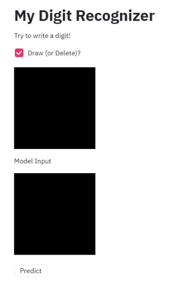

# Streamlit MNIST demo (drawable)

A simple digit recognition demo using [keras](https://www.tensorflow.org/overview) and [streamlit](https://www.streamlit.io/).



## Running demo

1. First install all the dependencies

    ```
    pip install -r requirements.txt
    ```

2. Train model

    Run all the cells of [train.ipynb](train.ipynb) manually or run it using runipy.

    ```
    runipy train.ipynb
    ```

3. Run demo web-app

    Demo your model by running [app.py](app.py)

    ```
    streamlit run app.py
    ```

